# From Podman AI Lab to OpenShift AI

**Overview**

A common statement from many people today is "I want the ability to chat with my documents". They might be aware that Large Language Models (LLMs) provide them the ability to do that, but the implementation details are unknown as well as the possible risks. These unknowns make it difficult to understand where to start. 

Thankfully, there is a path forward with the newly released Podman AI Lab extension. Podman AI Lab allows you to pull down models and test them out locally to see how they perform and which one(s) will work best for your use case(s). The chatbot recipe within Podman AI Lab makes integrating LLMs with applications as easy as the click of a button.

Podman AI Lab is an excellent place to evaluate and test models, but you'll eventually want to see how this will actually be deployed in your enterprise. For that, we can use OpenShift and OpenShift AI along with the Elasticsearch vector database to create a Retrieval Augmented Generation (RAG) chatbot.

This article will walk you through how to go from a chatbot recipe in the Podman AI Lab extension to a RAG chatbot deployed on OpenShift and OpenShift AI. 

## High Level Architecture


1. An LLM is downloaded through Podman AI Lab.

2. A chatbot recipe is started in Podman AI Lab with the downloaded model.

3. The chatbot recipe code from Podman AI Lab is updated in VS Code with LangChain to connect to the Elasticsearch vector database and OpenShift AI model serving inference endpoint.

4. An ingestion notebook is run in OpenShift AI to add data to the Elasticsearch vector database. 

5. The LLM we downloaded from Podman AI Lab is deployed to OpenShift AI on a custom serving runtime.

6. The updated chatbot with LangChain is built as a container and deployed to OpenShift.

## Requirements
It is expected that you have admin access to an OpenShift 4.12+ cluster. The following code was tested with an OpenShift 4.15 cluster and OpenShift AI 2.9.

## Podman AI Lab
### Install Podman Desktop and Podman AI Lab extension
Follow the installation instructions for Podman Desktop and the Podman AI Lab extension in the below Red Hat Developer article. The article also gives a great overview of the features in Podman AI Lab. 
[Podman AI Lab - Getting Started](https://developers.redhat.com/articles/2024/05/07/podman-ai-lab-getting-started){:target="_blank"}

### Download the model
We will be downloading and using the TheBloke/Mistral-7B-Instruct-v0.2-GGUF. This model is quantised (smaller) version of the full Mistral-7B-Instruct-v0.2. The smaller model will allow us to run inferencing on CPUs if GPUs are not an option.


1. Go to the AI Lab extension and select Catalog under Models.


2. If you haven't already, download the _TheBloke/Mistral-7B-Instruct-v0.2-GGUF_ model.
 
+ The model is around 4GB so it might take some time. 


3. Podman AI Lab allows you to get started quickly with downloaded models through Services, Playgrounds, and the Recipes Catalog. 
      1. **Services** -
      The Services section allows you to create a model service endpoint for models you've downloaded. Client code is provided (cURL by default) in multiple formats to get you started quickly with sending in requests to the model service endpoint. 
      

      1. **Playgrounds** -
      The Playgrounds area allows you to define system prompts and experiment with different settings like temperature, max tokens, and top-p.
      

      1. **Recipes Catalog** -
      The Recipes Catalog contains demo applications for Natural Language Processing (NLP), Computer Vision, and Audio. We'll be using the ChatBot recipe demo code in this example.

5. **Create the Chatbot** -
Make sure to select _TheBloke/Mistral-7B-Instruct-v0.2-GGUF_ as your model and then click **_Start AI App_** button.


6. After the chatbot has started open it up to test it out.


7. At the bottom of the AI App Details section you'll see a **_Open in VSCode_** button. Clicking on that will open all of the code that is running your chatbot. Later we'll modify that code to connect langchain, TheBloke/Mistral-7B-Instruct-v0.2-GGUF model, and the Elasticsearch Vector Database. 
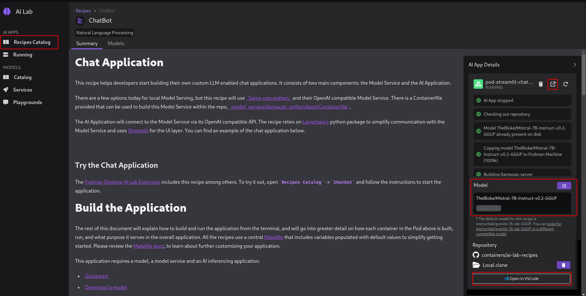

## Deploying OpenShift AI

1. Login to your OpenShift cluster in a terminal with the API token. You can get your API token from the OpenShift web console.
     
    ```
    oc login --token=<YOUR_OPENSHIFT_API_TOKEN> --server=https://<YOUR_OPENSHIFT_API_URL>:6443
    ```

2. We'll first deploy the OpenShift AI operator. 
    ```
    oc apply -k ./components/openshift-ai/operator/overlays/fast
    ```

3. Now we'll create a Data Science Cluster. Make sure the operator is fully deployed before creating the Data Science Cluster.
    ```
    watch oc get pods -n redhat-ods-operator
    ```

    

    Once the pod has a Running status and is ready you can run the below command.
    + ```
    oc apply -k ./components/openshift-ai/instance/overlays/fast
    ```

## Deploy Elasticsearch Vector DB

1. We'll now deploy the Elasticsearch operator. This will be our vector database.

    ```
    oc apply -k ./components/elasticsearch/base/
    ```

2. Now we can create an Elasticsearch cluster instance. Make sure the Elasticsearch operator pod is in a running state and ready.
    ```
    watch oc get pods -n elastic-vectordb
    ```

    

    ```
    oc apply -f ./components/elasticsearch/cluster/instance.yaml
    ```

### Ingest data into the Elasticsearch Vector Database

Now that the Elasticsearch operator has been deployed and an instance created, we can ingest some data and query the vector database.

1. Go to your OpenShift AI Dashboard. You can get the URL either from the below oc command or the OpenShift web console.
    ```
    oc get routes -n redhat-ods-applications
    ```
    OR

    Select the redhat-ods-applications project, the Networking -> Routes, and then open the URL under Location.

    

2. Login to the dashboard and select **Data Science Projects** and click the **Create Data Science Project** button.

    

3. Name the project *podman-ai-lab-rag-project* and click the **Create** button.

    

4. We'll now create a workbench where we can upload a Jupyter notebook to ingest data into the Elasticsearch vector DB. We'll then test it out by querying for some data. Click the **Create a workbench** button.

    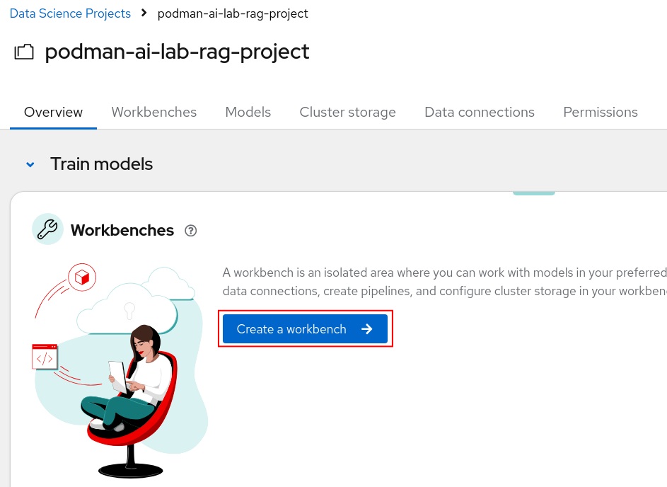

5. Name the workbench *elastic-vectordb-workbench*, select a *Standard Data Science* notebook, and select a *Medium* size.

    

    You'll also want to set two environment variables so we can connect to Elasticsearch from the notebook. 

    - **CONNECTION_STRING** - Copy the CLUSTER-IP and PORT from this oc command

        ```
        oc get service elasticsearch-sample-es-http -n elastic-vectordb
        ```
      
        Add the **CONNECTION_STRING** key/value as a ConfigMap environment variable.

    - **PASSWORD** - Create a secret environment variable with the Elasticsearch secret value.
        ```
        oc get secret elasticsearch-sample-es-elastic-user -n elastic-vectordb -o jsonpath="{.data['elastic']}" | base64 -d > elastic_pass.txt
        ```

        Add the **PASSWORD** key/value as a Secret environment variable. The password is in the **elastic_pass.txt** file that was created by the above oc command.

    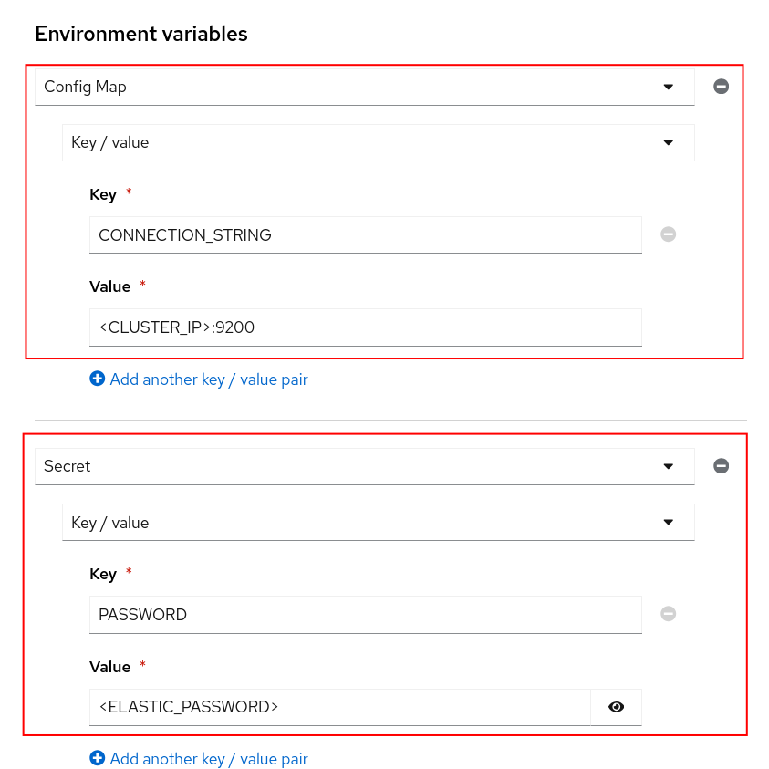

    **NOTE:** *You can delete the elastic_pass.txt file that you got the password from after you add it to the environment variable.*

    Click on the **Create Workbench** button. Your workbench should start in a few minutes.

6. Open your workbench after it has started and login.
    
    **Note:** *If you have insufficient resources to start a medium container size then stop the workbench and change the workbench to start as a small container size.*

7. Upload or import the ./notebooks/Langchain-ElasticSearchVector-ingest.ipynb notebook to your workbench.

    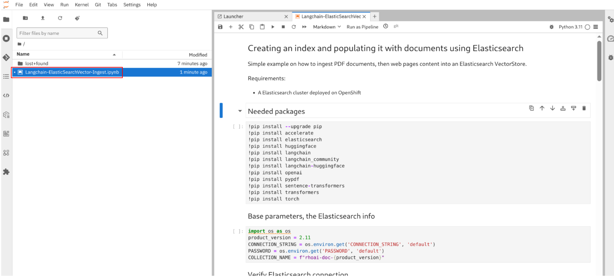

8. Run the first 3 cells (*Shift + Enter in each cell to run*). Make sure you can connect to your Elasticsearch cluster.

    

9. Continue to run through each cell while reading through what is occurring in each one. The *Create the index and ingest the documents* cell is where all of the websites and pdfs are stored with embeddings into the Elasticsearch vector database.

    This cell will take a while to run. Good time for a coffee break.

    

10. After all of the data is stored into our vector database we can directly query it. Run the last 2 cells to make sure the data was stored successfully and we get back the results we expect.

    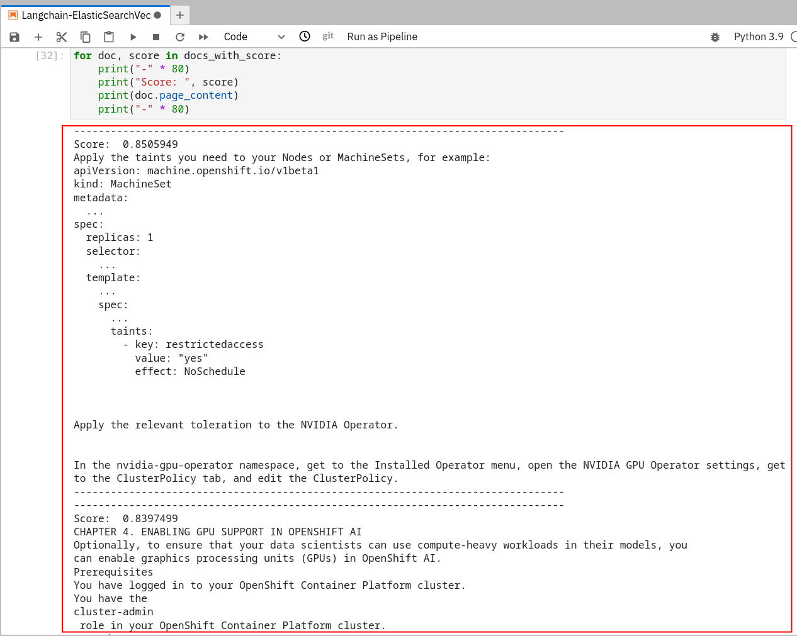

## Deploy s3 Storage (Minio)
OpenShift AI model serving has a dependency on s3 storage. We'll deploy Minio for this tutorial, but any s3 compatible storage should work. For an enterprise s3 storage solution consider [OpenShift Data Foundation](https://www.redhat.com/en/technologies/cloud-computing/openshift-data-foundation){:target="_blank"}.

1. Make sure you're still logged into your cluster in your terminal. Run the below command to deploy Minio.
    ```
    oc apply -k ./components/minio/base
    ```

    Make sure the pod is running.

    ```
    watch oc get pods -n minio
    ```

    

2. Login to the Minio UI. You can find the route in either the web console or from the oc cli in your terminal. Login with *minio/minio123*. Minio contains 2 routes, an API route and UI route. Make sure you use the UI route.

    

3. Create a bucket named *models* and click the **Create Bucket** button.

    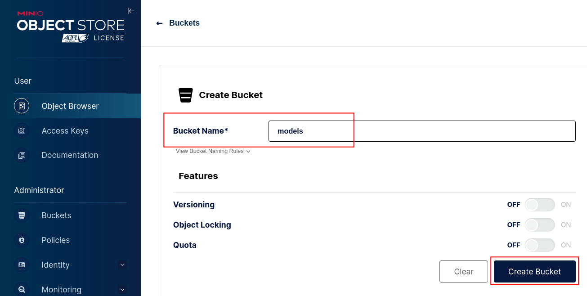

4. Go to **Object Browser**, select the *models* bucket you just created, and click the **Create new path** button. Name the folder path *mistral7b* and click the **Create** button.

    

5. Upload the Mistral7b model to the folder path you just created. You can find out where the model was downloaded if you go back to Podman AI Lab and click the **Open Model Folder** icon.

    

    In Minio click on the **Upload File** button and select the model file under the *hf.TheBloke.mistral-7b-instruct-v0.2.Q4_K_M* directory.

    

6. If the model is uploaded successfully you should see the below screen.

    

## Create Custom Model Serving Runtime

1. We first need to enable the single serving runtime before we can add our custom serving runtime.

    1. Run the following oc command to deploy Service Mesh.
        ```
        oc apply -k ./components/openshift-servicemesh/operator/overlays/stable
        ```
    2. Run the following oc command to deploy Serverless.
        ```
        oc apply -k ./components/openshift-serverless/operator/overlays/stable
        ```

    3. Wait until the Service Mesh and Serverless operators have installed successfully. 
        ```
        watch oc get csv -n openshift-operators
        ```

        

    4. We'll be using the single stack serving in OpenShift AI so we'll want use a trusted certificate instead of a self signed one. This will allow our chatbot to access the model inference endpoint.

          Run the below oc commands

          1. Get the name of the ingress cert we will need to copy. Select a secret that has **cert** in the name.
              ```
              oc get secrets -n openshift-ingress | grep cert
              ```

              

          2. Copy the full name of the secret and replace the name in the below oc command. Make sure you're in the top level directory of this project and run the below command.
              ```
              oc extract secret/ingress-certs-2024-06-03 -n openshift-ingress --to=ingress-certs --confirm
              ```

              You should now have a *ingress-certs* directory with a tls.crt and tls.key file.

              

          3. We'll now update the secret that will be used in our OpenShift AI data science cluster.

              ```
              cd ingress-certs

              oc create secret generic knative-serving-cert -n istio-system --from-file=. --dry-run=client -o yaml | oc apply -f -

              cd ..
              ```

              **NOTE:** *You can delete the ingress-certs folder after you have created the knative-serving-cert secret.*

    5. Run the following oc commands to enable the Single Model Serving runtime for OpenShift AI. 
        ```
        oc apply -k ./components/model-server/components-serving
        ```

    6. It will take around 5 to 10 minutes for the changes to be applied. Single-model serving should be ready when Service Mesh and Serverless have the below instances created. Open the OpenShift web console and go to **Operators -> Installed Operators**.

        

        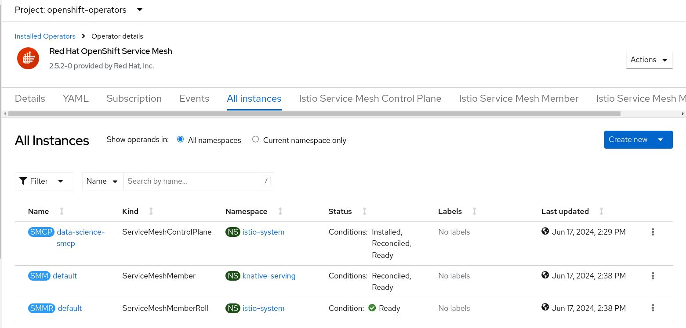

2. Go to the OpenShift AI dashboard and expand **Settings** and select **Serving Runtimes**. You should now see that Single-model serving enabled at the top of the page.

    **NOTE:** *You might need to refresh the page and it could take a few minutes for the changes to be applied.*

    

### Add a Custom Serving Runtime
We'll now add a custom serving runtime so we can deploy GGUF versions of models.

1. Click on the **Add serving runtime** button. 

    

2. Select **Single-model serving platform** for the runtime and select **REST** for the API protocol. Upload the *./components/custom-model-serving-runtime/llamacpp-runtime-custom.yaml* file as the serving runtime. Click the **Create** button.

    

    **NOTE:** *I've included a pre-built image that is public. You can build your own image with the Containerfile under ./components/ucstom-model-serving-runtime if you would rather pull from your own repository.*

3. If the serving runtime was added was succesfully you should now see it in the list of serving runtimes available. 

    

4. Go to your *podman-ai-lab-rag-project* and select **Models**. You should see two model serving type options. Click on the **Deploy model** under the Single-model serving platform. 

    

5. Fill in the following values and click the **Deploy** button at the bottom of the form.

      - Model name = **mistral7b**
      - Serving runtime = **LlamaCPP**
      - Model framework = **any**
      - Model server size = **Medium**
      - Select **New data connection**
      - Name = **models**
      - Access key = **minio**
      - Secret key = **minio123**
      - Endpoint = **Your Minio API URL**
      - Region = **us-east-1**
      - Bucket = **models**
      - Path = **mistral7b**

    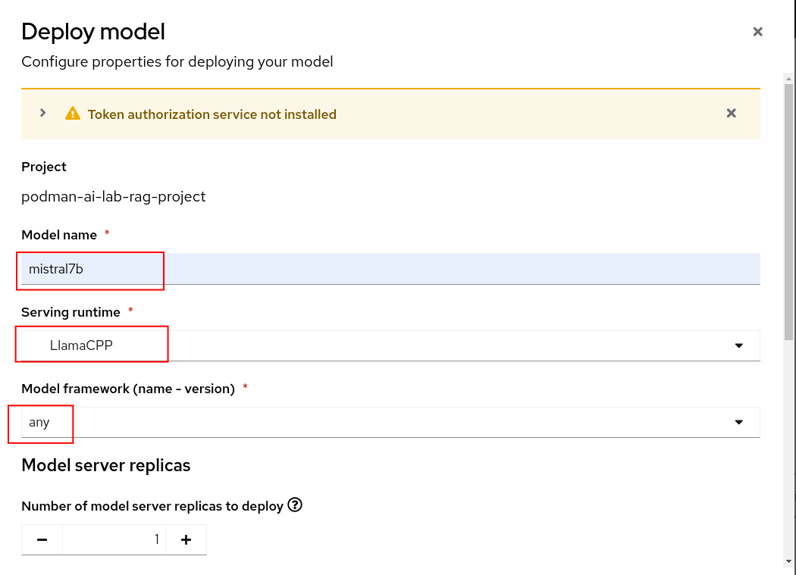

    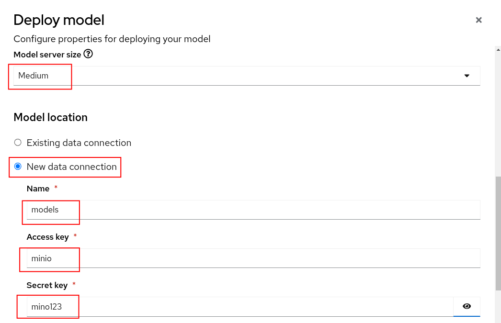

    

6. If your model deploys successfully you should see the following page.

    

7. Test your model to make sure you can send in a request and get a response. You can use the client code that is provided by the model service in Podman AI Lab. 

      Make sure to update the URL in the cURL command to the Inference endpoint on OpenShift AI.


      ```
      curl -k --location 'https://YOUR-OPENSHIFT-AI-INFERENCE-ENDPOINT/v1/chat/completions' --header 'Content-Type: application/json' --data '{
        "messages": [
          {
            "content": "You are a helpful assistant.",
            "role": "system"
          },
          {
            "content": "How large is the capital of France?",
            "role": "user"
          }
        ]
      }'
      ```

    Your response should be similar to the following

    ```
    {"id":"chatcmpl-c76974b1-4709-41a5-87cf-1951e10886fe","object":"chat.completion","created":1717616440,"model":"/mnt/models/mistral-7b-instruct-v0.2.Q4_K_M.gguf","choices":[{"index":0,
    "message":{"content":" The size of a city's area, including its metropolitan area, can vary greatly, and when referring to the 
    \"capital\" of a country like France, people usually mean the city itself rather than its total metropolitan area. Paris, the capital 
    city of France, covers an urban area of approximately 105 square 
    kilometers (40.5 square miles) within its administrative limits.
    \n\nHowever, if you are asking about the total area of the Paris 
    Metropolitana region, which includes suburban areas and their 
    combined population, it is much larger at around 13,022 square 
    kilometers (5,028 square miles). This encompasses more than just the city of Paris.",
    "role":"assistant"},"logprobs":null,"finish_reason":"stop"}],"usage":{"prompt_tokens":32,"completion
    ```

## Update the Chat Recipe Application
We'll now update the chat recipe application that we created from Podman AI Lab to use Langchain to connect the model we just deployed on OpenShift AI and the Elasticsearch vector database.

1. We'll start from the default chatbot recipe code accessible from Podman AI Lab. In Podman AI Lab, after clicking the **Open in VSCode** button you should see the following.

    

    The only code we'll need to modify is under the *app* directory.

2. Open the ./components/app/chatbot_ui.py file. 

    - We'll first get some environment variables.

      

      Then we'll add in the Langchain code to give us our RAG functionality. Note the items highlighted in red. Specifically where the model_service or your OpenShift AI inference endpoint URL and the Elasticsearch setup. Finally, take note of how both of these are passed to Langchain (chain).

      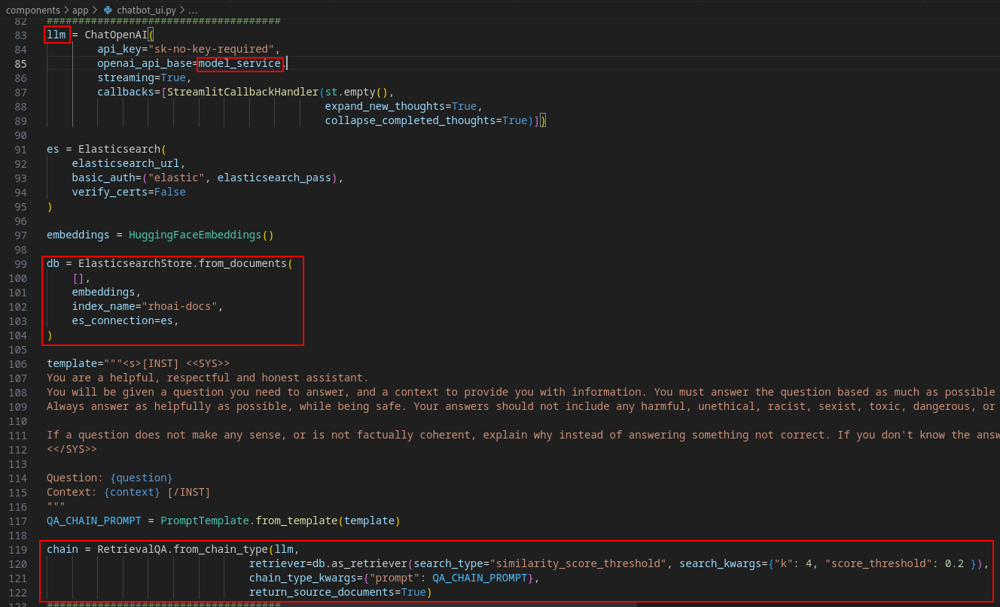

    - The last updates to the code are just to format the response so that the relevant documents will be included. Extra packages were also added to the ./components/app/requirements.txt file.

3. You can build the Containerfile and push it to your own repository or you can use the one at quay.io/jhurlocker/elastic-vectordb-chat.

4. Update the ./components/deployment.yaml file with your values for the MODEL_ENDPOINT, ELASTIC_URL, and ELASTIC_PASS environment variables.

    

5. Create the project

    ```
    oc new-project elastic-vectordb-chat
    ```

6. Apply the deployment.yaml you just updated to deploy the chatbot application.

    ```
    oc apply -f ./components/app/deployment.yaml
    ```

7. Get the route to the chatbot application

    ```
    oc get route -n elastic-vectordb-chat
    ```

    Open the application in your browser

    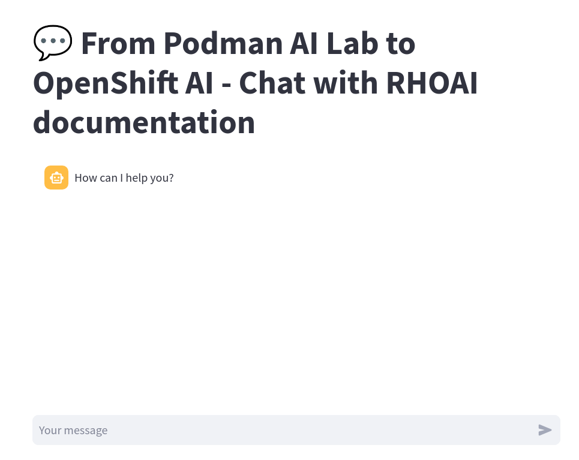

8. Type in a message and press Enter. It might take awhile to respond if the model is deployed on a CPU.

    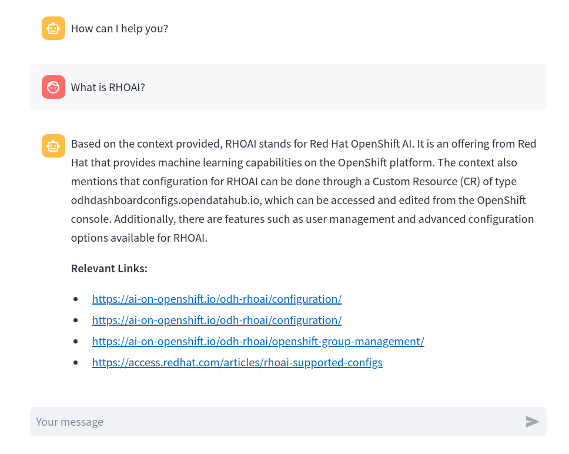

9. In the OpenShift web console you can check the model server logs under the podman-ai-lab-rag-project -> Workloads -> Pods (mistral7b-*) -> Logs. Note the log statements when a message is sent to the model inference endpoint.

    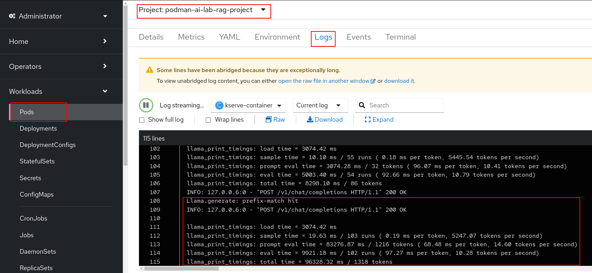

10. Congratulations! You've successfully taken a model and application from Podman AI Lab and created a RAG chatbot deployed on OpenShift and OpenShift AI.

*Special thanks to the maintainers of the below repositories.*

- [LLM On OpenShift](https://github.com/rh-aiservices-bu/llm-on-openshift){:target="_blank"}
  *The notebook to ingest data into Elasticsearch and the Langchain code added to the chatbot app.*

- [AI Accelerator](https://github.com/redhat-ai-services/ai-accelerator){:target="_blank"}
  *The code used to deploy the various components on OpenShift and OpenShift AI.*