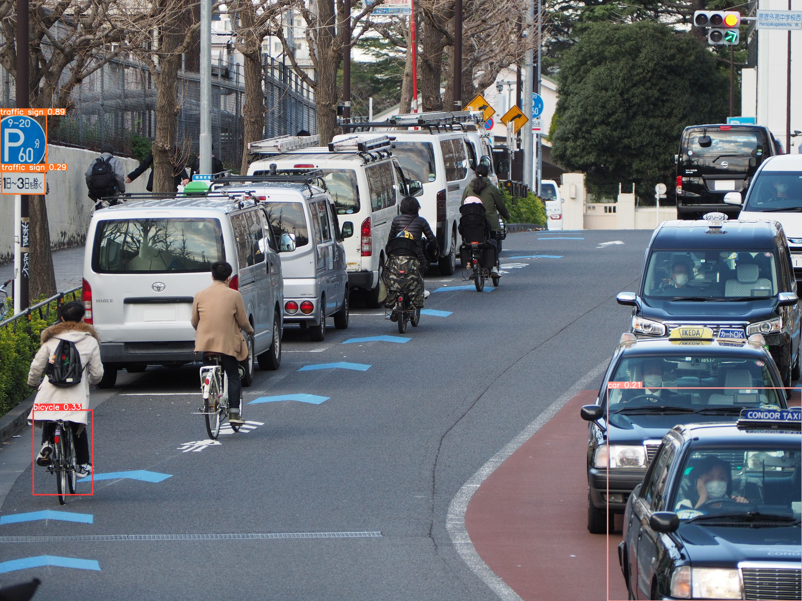
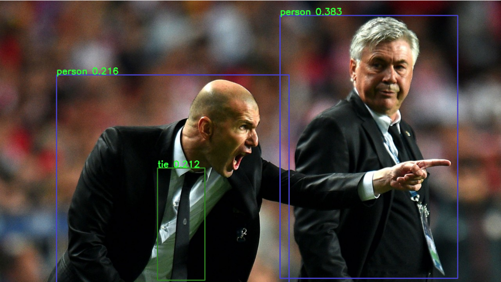

# Model Training and Serving - YOLOv5

In this tutorial, we're going to see how you can customize YOLOv5, an object detection model, to recognize specific objects in pictures, and how to deploy and use this model.

## YOLO and YOLOv5

YOLO (You Only Look Once) is a popular object detection and image segmentation model developed by Joseph Redmon and Ali Farhadi at the University of Washington. The first version of YOLO was released in 2015 and quickly gained popularity due to its high speed and accuracy.

YOLOv2 was released in 2016 and improved upon the original model by incorporating batch normalization, anchor boxes, and dimension clusters. YOLOv3 was released in 2018 and further improved the model's performance by using a more efficient backbone network, adding a feature pyramid, and making use of focal loss.

In 2020, YOLOv4 was released which introduced a number of innovations such as the use of Mosaic data augmentation, a new anchor-free detection head, and a new loss function.

In 2021, Ultralytics released **[YOLOv5](https://github.com/ultralytics/yolov5/){:target="_blank"}**, which further improved the model's performance and added new features such as support for panoptic segmentation and object tracking.

YOLO has been widely used in a variety of applications, including autonomous vehicles, security and surveillance, and medical imaging. It has also been used to win several competitions, such as the COCO Object Detection Challenge and the DOTA Object Detection Challenge.

## Model training

YOLOv5 has already been trained to recognize some objects. Here we are going to use a technique called Transfer Learning to adjust YOLOv5 to recognize a custom set of images.

### Transfer Learning

Transfer learning is a machine learning technique in which a model trained on one task is repurposed or adapted to another related task. Instead of training a new model from scratch, transfer learning allows the use of a pre-trained model as a starting point, which can significantly reduce the amount of data and computing resources needed for training.

The idea behind transfer learning is that the knowledge gained by a model while solving one task can be applied to a new task, provided that the two tasks are similar in some way. By leveraging pre-trained models, transfer learning has become a powerful tool for solving a wide range of problems in various domains, including natural language processing, computer vision, and speech recognition.

Ultralytics have fully integrated the transfer learning process in YOLOv5, making it easy for us to do. Let's go!

### Environment and prerequisites

- This training should be done in a **Data Science Project** to be able to modify the Workbench configuration (see below the /dev/shm issue).
- YOLOv5 is using **PyTorch**, so in RHOAI it's better to start with a notebook image already including this library, rather than having to install it afterwards.
- PyTorch is internally using shared memory (/dev/shm) to exchange data between its internal worker processes. However, default container engine configurations limit this memory to the bare minimum, which can make the process exhaust this memory and crash. The solution is to manually increase this memory by mounting a specific volume with enough space at this emplacement. This problem will be fixed in an upcoming version. Meanwhile you can use **[this procedure](https://access.redhat.com/documentation/en-us/red_hat_openshift_data_science_self-managed/1.28/html-single/1.28_release_notes/index#known-issues_RHOAI-8939_relnotes){:target="_blank"}**.
- Finally, a **GPU** is strongly recommended for this type of training.

### Data Preparation

To train the model we will of course need some data. In this case a sufficient number of images for the various classes we want to recognize, along with their labels and the definitions of the bounding boxes for the object we want to detect.

In this example we will use images from [Google's Open Images](https://storage.googleapis.com/openimages/web/index.html){:target="_blank"}. We will work with 3 classes: **Bicycle**, **Car** and **Traffic sign**.

We have selected only a few classes in this example to speed up the process, but of course feel free to adapt and choose the ones you want.

For this first step:

- If not already done, create your Data Science Project,
- Create a Workbench of type **PyTorch**, with at least **8Gi** of memory, **1 GPU** and **20GB** of storage.
- Apply [this procedure](https://access.redhat.com/documentation/en-us/red_hat_openshift_data_science_self-managed/1.28/html-single/1.28_release_notes/index#known-issues_RHOAI-8939_relnotes){:target="_blank"} to increase shared memory.
- Start the workbench.
- Clone the repository [https://github.com/rh-aiservices-bu/yolov5-transfer-learning](https://github.com/rh-aiservices-bu/yolov5-transfer-learning){:target="_blank"}, open the notebook 01-data_preparation.ipynb and follow the instructions.

Once you have completed to whole notebook the Dataset is ready for training!

### Training

In this example, we will do the training with the smallest base model available to save some time. Of course you can change this base model and adapt the various hyperparameters of the training to improve the result.

For this second step, from the same workbench environment, open the notebook `02-model_training.ipynb` and follow the instructions.

!!! warning
    The amount of memory you have assigned to your Workbench has a great impact on the batch size you will be able to work with, independently of the size of your GPU. For example, a batch size of 128 will barely fit into an 8Gi of memory Pod. The higher the better, until it breaks... Which you will find out soon anyway, after the first 1-2 epochs.

!!! note
    During the training, you can launch and access Tensorboard by:

      - Opening a Terminal tab in Jupyter
      - Launch Tensorboard from this terminal with `tensorboard --logdir yolov5/runs/train`
      - Access Tensorboard in your browser using the same Route as your notebook, but replacing the `.../lab/...` part by `.../proxy/6006/`. Example: `https://yolov5-yolo.apps.cluster-address/notebook/yolo/yolov5/proxy/6006/`

Once you have completed to whole notebook you have a model that is able to recognize the three different classes on a given image.

## Model Serving

We are going to serve a YOLOv5 model using the ONNX format, a general purpose open format built to represent machine learning models. RHOAI Model Serving includes the OpenVino serving runtime that accepts two formats for models: OpenVino IR, its own format, and ONNX.

!!! note
    Many files and code we are going to use, especially the ones from the utils and models folders, come directly from the YOLOv5 repository. They includes many utilities and functions needed for image pre-processing and post-processing. We kept only what is needed, rearranged in a way easier to follow within notebooks. YOLOv5 includes many different tools and CLI commands that are worth learning, so don't hesitate to have a look at it directly.

### Environment and prerequisites

- YOLOv5 is using PyTorch, so in RHOAI it's better to start with a notebook image already including this library, rather than having to install it afterwards.
- Although not necessary as in this example we won't use the model we trained in the previous section, the same environment can totally be reused.

### Converting a YOLOv5 model to ONNX

YOLOv5 is based on PyTorch. So base YOLOv5 models, or the ones you retrain using this framework, will come in the form of a `model.pt` file. We will first need to convert it to the ONNX format.

- From your workbench, clone the repository [https://github.com/rh-aiservices-bu/yolov5-model-serving](https://github.com/rh-aiservices-bu/yolov5-model-serving){:target="_blank"}.
- Open the notebook `01-yolov5_to_onnx.ipynb` and follow the instructions.
- The notebook will guide you through all the steps for the conversion. If you don't want to do it at this time, you can also find in this repo the original YOLOv5 "nano" model, `yolov5n.pt`, and its already converted ONNX version, `yolov5n.onnx`.

Once converted, you can save/upload your ONNX model to the storage you will use in your Data Connection on RHOAI. At the moment it has to be an S3-Compatible Object Storage, and the model must be in it own folder (not at the root of the bucket).

### Serving the model

Here we can use the standard configuration path for RHOAI Model Serving:

- Create a Data Connection to the storage where you saved your model. In this example we don't need to expose an external Route, but of course you can. In this case though, you won't be able to directly see the internal gRPC and REST endpoints in the RHOAI UI, you will have to get them from the Network->Services panel in the OpenShift Console.
- Create a Model Server, then deploy the model using the ONNX format.

!!! note
    You can find full detailed versions of this procedure [in this Learning Path](https://developers.redhat.com/learn/openshift-data-science/model-serving-rhods){:target="_blank"} or in the [RHOAI documentation](https://access.redhat.com/documentation/en-us/red_hat_openshift_data_science_self-managed/1-latest/html/working_on_data_science_projects/model-serving-on-openshift-data-science_model-serving){:target="_blank"}.

### gRPC connection

With the gRPC interface of the model server, you have access to different Services. They are described, along with their format, in the `grpc_predict_v2.proto` file.

There are lots of important information in this file: how to query the service, how to format the data,... This is really important as the data format is not something you can "invent", and not exactly the same compared as the REST interface (!).

This proto file, which is a service description meant to be used with any programming language, has already been converted to usable Python modules defining objects and classes to be used to interact with the service: `grpc_predict_v2_pb2.py` and `grpc_predict_v2_pb2_grpc.py`. If you want to learn more about this, the conversion can be done using the [protoc](https://grpc.io/docs/protoc-installation/){:target="_blank"} tool.

You can use the notebook `02-grpc.ipynb` to connect to the interface and test some of the services. You will see that many "possible" services from ModelMesh are unfortunately simply not implemented with the OpenVino backend at the time of this writing. But at least ModelMetadata will give some information on the formats we have to use for inputs and outputs when doing the inference.

### Consuming the model over gRPC

In the `03-remote_inference_grpc.ipynb` notebook, you will find a full example on how to query the grpc endpoint to make an inference. It is backed by the file `remote_infer_grpc.py`, where most of the relevant code is:

- Image preprocessing on L35: reads the image and transforms it in a proper numpy array
- gRPC request content building on L44: transforms the array in the expected input shape (refer to model metadata obtained in the previous notebook), then flatten it as expected by ModelMesh.
- gRPC calling on L58.
- Response processing on L73: reshape the response from flat array to expected output shape (refer to model metadata obtained in the previous notebook), run NMS to remove overlapping boxes, draw the boxes from results.

The notebook gives the example for one image, as well as the processing of several ones from the `images` folder. This allows for a small benchmark on processing/inference time.

### Consuming the model over REST

In the `04-remote_inference_rest.ipynb` notebook, you will find a full example on how to query the gRPC endpoint to make an inference. It is backed by the file `remote_infer_rest.py`, where most of the relevant code is:

- Image preprocessing on L30: reads the image and transforms it in a proper numpy array
- Payload building on L39: transforms the array in the expected input shape (refer to model metadata obtained in the previous notebook).
- REST calling on L54.
- Response processing on L60: reshape the response from flat array to expected output shape (refer to model metadata obtained in the previous notebook), run NMS to remove overlapping boxes, draw the boxes from results.

The notebook gives the example for one image, as well as the processing of several ones from the `images` folder. This allows for a small benchmark on processing/inference time.

### gRPC vs REST

Here are a few elements to help you choose between the two available interfaces to query your model:

- REST is easier to implement: it is a much better known protocol for most people, and involves a little bit less programming. There is no need to create a connection, instantiate objects,... So it's often easier to use.
- If you want to query the model directly from outside OpenShift, you have to use REST which is the only one exposed. You can expose gRPC too, but it's kind of difficult right now.
- gRPC is **wwwwwaaaayyyyy much faster** than REST. With the exact same model serving instance, as showed in the notebooks, inferences are about 30x faster. That is huge when you have score of images to process.
