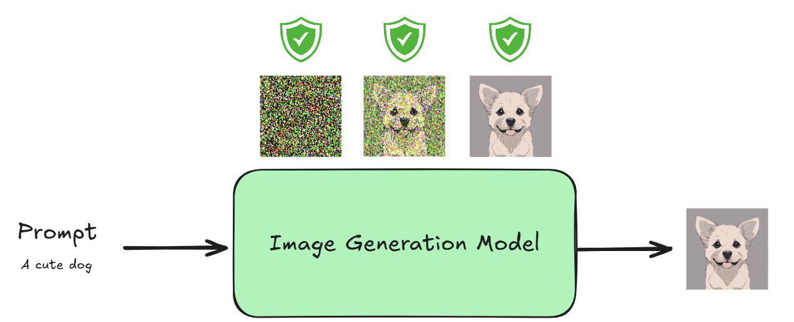
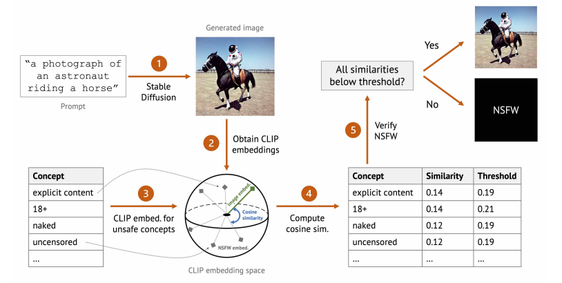

# Stable Diffusion Safety Checker

## Image Guardrails

When generating images, you want to be able to check whether your model's outputs are safe to display and block them if they are not.  
This is where image generation guardrails come into play. By using image models trained on unsafe content, we can classify the output images to ensure they comply with our guidelines.  
Without these kinds of safeguards, users would be able to generate unethical and harmful content from our models.  

### **Key risks when not using guardrails:**  
- Non-Consensual or Exploitative Imagery – The ability to create non-consensual deepfake content, including explicit images of real people without their permission, leading to severe ethical and legal consequences.
- Harmful and Inappropriate Content – The generation of violent, explicit, or illegal material.
- Intellectual Property and Copyright Infringement – The replication of or close resemblance to copyrighted content, leading to potential legal and ethical issues.

## Stable Diffusion Safety Checker

The Stable Diffusion Safety Checker is one of these image guardrails, specifically built for analyzing the outputs of diffusion models.  
It allows application developers to check any images generated by a Stable Diffusion model before displaying them to end-users.

The model it uses is the [Stable Diffusion Safety Checker](https://huggingface.co/CompVis/stable-diffusion-safety-checker) which is based on a fine-tuned [CLIP model](https://huggingface.co/openai/clip-vit-large-patch14) under the [MIT License](https://github.com/openai/CLIP/blob/main/LICENSE).  

### How does it work?   

The Stable Diffusion Safety Checker compares embeddings (a list of values that represent the image) generated by the model with predefined embeddings that represent harmful images. If the output embedding is too close to any of the predefined embeddings, the model will output `True`, meaning that the image may be harmful. Otherwise, it will output `False`.  
You can find the full code in this [HuggingFace repo](https://github.com/huggingface/diffusers/blob/main/src/diffusers/pipelines/stable_diffusion/safety_checker.py).

Reference [contains NSFW topics]: https://arxiv.org/pdf/2210.04610

### How can you customize it?

Since the model simply evaluates how close an image is to different embeddings, a straightforward way to customize it is to add a new predefined embedding of an image you ran through the model. This will cause the model to return `True` for all images that are similar to the new embedding.  
However, note that while this method works, it has limitations in quality. For improved accuracy when adding new categories, fine-tuning the model is recommended.

# Examples

You can find a [notebook](https://github.com/rh-aiservices-bu/image-generation-on-openshift/blob/main/stable-diffusion-safety-checker/local_safety_checker.ipynb) with an example of using and customizing the Safety Checker.  
There is also a [InferenceService template](https://github.com/rh-aiservices-bu/image-generation-on-openshift/blob/main/stable-diffusion-safety-checker/InferenceService.yaml) (make sure to add a GPU if you want it to run faster) and a [custom runtime](https://github.com/rh-aiservices-bu/image-generation-on-openshift/blob/main/stable-diffusion-safety-checker/runtime/) to serve with KServe, as well as a simple request [notebook](https://github.com/rh-aiservices-bu/image-generation-on-openshift/blob/main/stable-diffusion-safety-checker/example_request.ipynb) you can use to send requests to the served model.  

## More model details

The original model’s categories were obfuscated to prevent people from bypassing them. However, they have since been reverse-engineered.  
⚠️ **Note:** The following paper and example expose NSFW categories. Enter at your own risk. ⚠️  
- [Paper](https://arxiv.org/pdf/2210.04610) describing the model in depth.
- [Example](https://colab.research.google.com/drive/1TWQae-fBpw7vS7j-N1WAM_30Mq2N80JL) where the categories are revealed in the model response.
